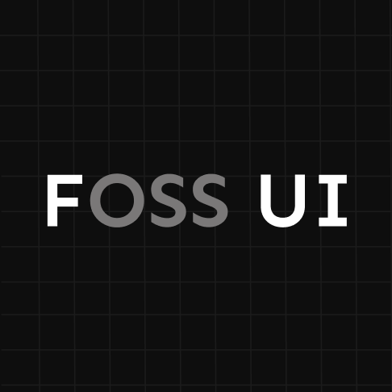
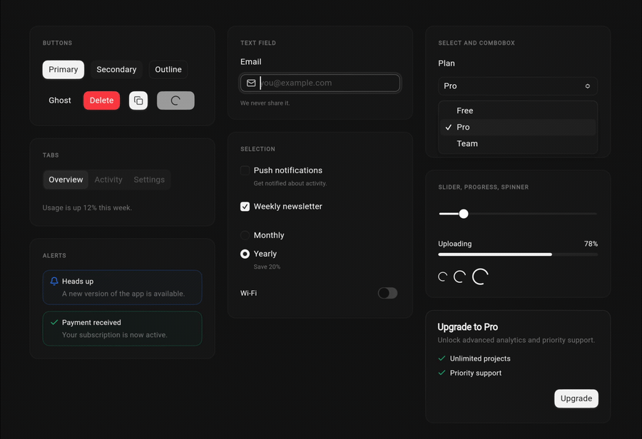

<div align="center">



**Minimal, framework-agnostic Flutter components. Themed from one source. Inspired by [coss.com/ui](https://coss.com/ui), Cal.com's design system.**

[](https://pub.dev/packages/fossui) [](https://pub.dev/packages/fossui/score) [](https://pub.dev/packages/fossui/score) [](https://pub.dev/packages/fossui) [](https://fossui.github.io/fossui) [](LICENSE) 

</div>

<p align="center">
  
</p>

fossui is a component set for developers tired of every Flutter app looking like
Material. It drops into any app, whether you use `MaterialApp`, `CupertinoApp`,
or a bare `WidgetsApp`, and reads its own theme first rather than replacing
yours. The look is drawn from [coss.com/ui](https://coss.com/ui), Cal.com's
design system: clean and neutral, with superellipse corners. One import, one
theme, light and dark out of the box.

> [!NOTE]
> Under active development. `0.1.0` ships 21 components. Under 0.x, APIs and
> tokens can still change between releases, so pin a version you have tested
> against.

> [!IMPORTANT]
> Unofficial and independent. Not affiliated with or endorsed by Cal.com, Inc.
> or coss.com. See [NOTICE](NOTICE) for attribution.

## Features

- **A look that isn't Material.** A neutral, understated aesthetic with
  superellipse corners, drawn from the coss/Cal.com design language.
- **Framework-agnostic.** Built on `package:flutter/widgets.dart`, with no
  platform channels and no `FossApp` wrapper. The widgets work under any app
  shell.
- **Reads your theme, not the other way around.** Components resolve
  `context.fossTheme` before falling back to Material, so they keep their look
  inside an existing app.
- **Themed from one source.** A single `FossThemeData` holds every semantic
  token: color, type, radius, spacing, shadow, motion. Reskin the whole app,
  light and dark, in one call.
- **Light on dependencies.** One runtime dependency and no bundled icon package.
  A worst-case app that imports nearly every component adds about 314 KB, most of
  it the Geist font (~36 KB over the wire), and the Dart code tree-shakes to what
  you use. Pass your own icons through plain `Widget` slots.
- **Preview-rich docs.** Every component's API doc renders a live light and dark
  preview, not just text, and the same preview shows on hover in your IDE. Each
  one states plainly what it does and does not do.
- **Accessible by default.** Semantics, focus, and touch targets are built into
  each component.

## Install

```yaml
dependencies:
  fossui: ^0.1.0
```

Or from the command line:

```bash
flutter pub add fossui
```

## Quick start

Register the theme once, then use the widgets anywhere.

```dart
import 'package:flutter/material.dart';
import 'package:fossui/fossui.dart';

void main() => runApp(
      MaterialApp(
        theme: FossThemeData.light.toThemeData(),
        darkTheme: FossThemeData.dark.toThemeData(),
        home: Scaffold(
          body: Center(
            child: FossButton(
              onPressed: () {},
              child: const Text('Get started'),
            ),
          ),
        ),
      ),
    );
```

Not using Material? There is no `FossApp` to add. Wrap your tree in a
`FossTheme` instead, and `context.fossTheme` resolves the same way under
`CupertinoApp` or a bare `WidgetsApp`.

See [`example/`](https://pub.dev/packages/fossui/example) for a runnable app.

## Theming

The defaults give fossui its look, but nothing is locked. Read tokens through
one accessor:

```dart
final theme = context.fossTheme;
final color = theme.colors.primary;
final radius = theme.radii.md;
```

To reskin the app, layer a `FossThemeSpec` over a base theme. Every field is
optional, and anything you leave unset keeps the default.

```dart
MaterialApp(
  theme: FossThemeData.light.retheme(
    const FossThemeSpec(primary: Color(0xFF16A34A), radius: 22),
  ).toThemeData(),
  darkTheme: FossThemeData.dark.retheme(
    const FossThemeSpec(primary: Color(0xFF51F0A8), radius: 22),
  ).toThemeData(),
);
```

## Components

The library covers input, feedback, overlays, and layout:

| Group | Components |
| --- | --- |
| Actions and input | Button, TextField, Select, Combobox, Checkbox, Radio, Switch, Slider |
| Feedback | Alert, Badge, Progress, Spinner, Toast, Tooltip |
| Overlays | Dialog, Drawer |
| Layout and media | Card, Tabs, Separator, Avatar |

See the [components roadmap](doc/components/roadmap.md) for what is shipped and
what is planned, and the [component checklist](doc/components/checklist.md) for
the bar each one clears.

## Icons

Icon slots accept a plain `Widget`, so any icon set works: Lucide, Material
Icons, Cupertino, SVGs, or your own. The package pulls in no icon dependency of
its own. Examples and docs use [Lucide](https://pub.dev/packages/lucide_icons)
as the documented companion.

## Platforms

With no platform channels, fossui runs anywhere Flutter does: Android, iOS, web,
macOS, Windows, and Linux are all supported.

## Ecosystem

- Documentation: [fossui.org](https://fossui.org)
- Live gallery: [play.fossui.org](https://play.fossui.org)
- MCP server: [mcp.fossui.org](https://mcp.fossui.org)
- Package: [pub.dev/packages/fossui](https://pub.dev/packages/fossui)

## Development

This package pins its Flutter SDK with [fvm](https://fvm.app):

```bash
fvm install          # uses .fvmrc (Flutter 3.41.9)
fvm flutter pub get
fvm flutter test
```

Coverage report: [fossui.github.io/fossui](https://fossui.github.io/fossui).
Contributions are welcome. See [CONTRIBUTING.md](CONTRIBUTING.md) and the
[Code of Conduct](CODE_OF_CONDUCT.md).

## Star History

<!-- star-history:start -->
[](https://star-history.com/#fossui/fossui&Date)
<!-- star-history:end -->
