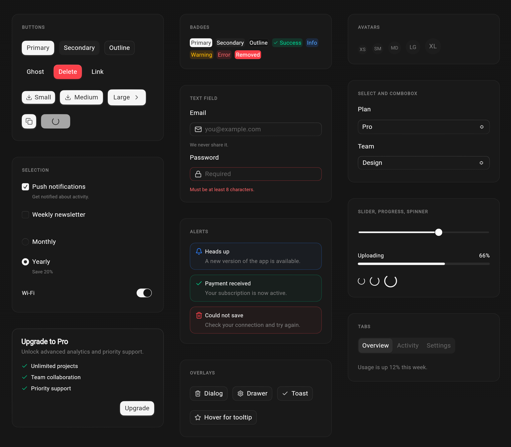
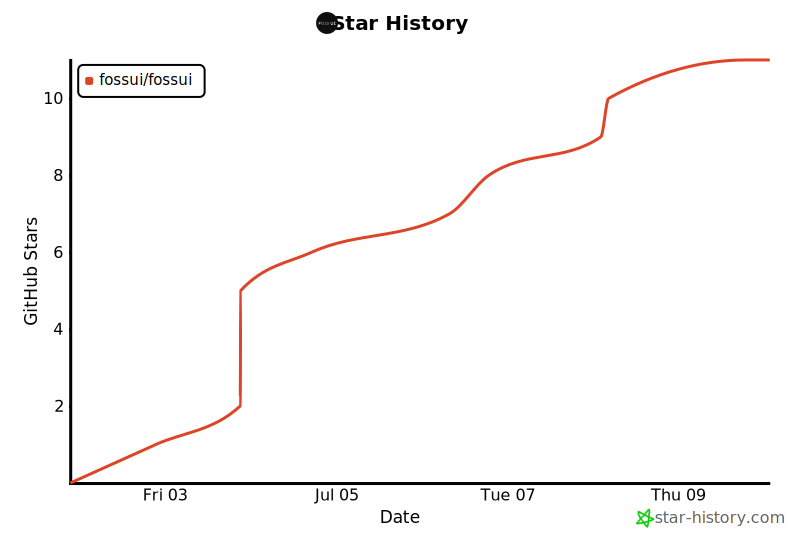

# fossui

An open-source Flutter UI library of themeable, accessible components, inspired
by coss.com/ui, Cal.com's design system. Themed from one source, one import.

> **Status: beta, under active development.** This pre-release
> (`0.1.0-beta.3`) ships 21 components, but APIs and tokens can still change
> between releases. Pin an exact version if you depend on it.

> **Unofficial.** Not affiliated with or endorsed by Cal.com, Inc. or coss.com.
> See [NOTICE](NOTICE) for attribution.





## Install

```yaml
dependencies:
  fossui: ^0.1.0-beta.3
```

## Usage

Register the theme once, then read tokens through `context.fossTheme`. There is
no `FossApp` wrapper; the library works under `MaterialApp`, `CupertinoApp`, or a
bare `WidgetsApp`.

```dart
import 'package:flutter/material.dart';
import 'package:fossui/fossui.dart';

void main() => runApp(
      MaterialApp(
        theme: FossThemeData.light.toThemeData(),
        darkTheme: FossThemeData.dark.toThemeData(),
        home: const Scaffold(
          body: Center(child: FossBadge(label: Text('fossui'))),
        ),
      ),
    );
```

See [`example/`](example/) for a runnable app. Components and theming are added
in tiers. See the
[components roadmap](doc/components/roadmap.md) for what is shipped and what is
planned, the [component checklist](doc/components/checklist.md) for the bar each
one clears, and [CHANGELOG.md](CHANGELOG.md) for released versions.

## Links

- Documentation: [fossui.org](https://fossui.org)
- Live gallery: [play.fossui.org](https://play.fossui.org)
- Package: [pub.dev/packages/fossui](https://pub.dev/packages/fossui)

## Platforms

Built on `package:flutter/widgets.dart` with no platform channels, so it runs
anywhere Flutter does. During the beta, mobile is the tested target:

| Platform | Status |
| --- | --- |
| iOS, Android | Tested and supported. |
| Web, macOS, Windows, Linux | Should work, not yet verified. Use with care. |

## Development

This package pins its Flutter SDK with [fvm](https://fvm.app):

```bash
fvm install          # uses .fvmrc (Flutter 3.41.9)
fvm flutter pub get
fvm flutter test
```

Contributions are welcome. See [CONTRIBUTING.md](CONTRIBUTING.md) for the
workflow and the [Code of Conduct](CODE_OF_CONDUCT.md).


## License

MIT. See [LICENSE](LICENSE) and [NOTICE](NOTICE).

## Star History

<!-- star-history:start -->
<picture>
  <source media="(prefers-color-scheme: dark)" srcset="assets/star-history/star-history-dark-20260710015559.svg">
  
</picture>
<!-- star-history:end -->
